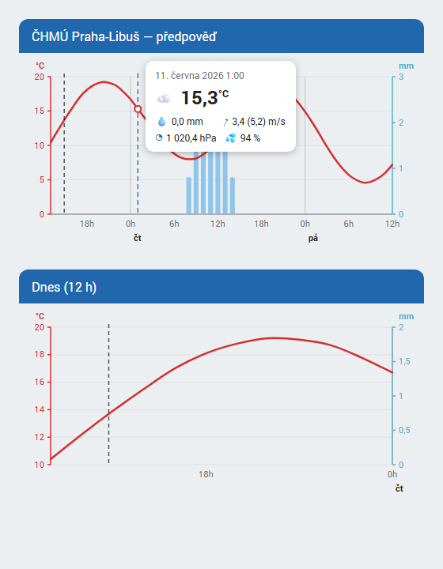

# ČHMÚ Meteogram Card

Lovelace karta pro Home Assistant, která vykresluje hodinový meteogram
(teplota + srážky) ve stylu mobilní aplikace **Počasí ČHMÚ**.

Data bere z weather entity integrace
[ha-chmu-meteogram](https://github.com/hruskin/ha-chmu-meteogram)
(model ALADIN, ČHMÚ) — funguje ale s libovolnou weather entitou,
která podporuje hodinovou předpověď (`weather/subscribe_forecast`).



- 🌡️ teplota — červená vyhlazená křivka, levá osa
- 🌧️ srážky — světle modré sloupce, pravá osa (mm)
- 🕐 osa X po hodinách (`0h / 6h / 12h / 18h`), zkratky dnů na půlnočních
  zlomech (`st`, `čt`, …)
- ⏱️ přerušovaná svislá čára „teď"
- 👆 interaktivní kurzor — najetím myší / tažením prstem se zobrazí bublina
  s detaily vybrané hodiny (piktogram počasí, teplota, srážky, vítr + nárazy,
  tlak, vlhkost), jako v aplikaci ČHMÚ; mimo graf se schová
- 🕓 časové údaje respektují jazyk i formát času (12/24 h) z nastavení HA
- 🔧 nastavitelný časový rozsah 6–73 hodin
- 🎨 modrá hlavička, barvy přizpůsobitelné přes CSS proměnné, GUI editor

## Instalace

### HACS (doporučeno)

1. HACS → tři tečky → **Custom repositories**
2. Repository: `https://github.com/hruskin/ha-chmu-meteogram-card`,
   typ: **Dashboard**
3. Nainstaluj **ČHMÚ Meteogram Card** a obnov stránku

### Ručně

Zkopíruj `chmu-meteogram-card.js` z [poslední release](../../releases)
do `config/www/` a přidej resource:

```yaml
url: /local/chmu-meteogram-card.js
type: module
```

## Konfigurace

```yaml
type: custom:chmu-meteogram-card
entity: weather.chmu_praha_predpoved
hours: 48
```

| Volba         | Typ     | Výchozí                 | Popis                                  |
| ------------- | ------- | ----------------------- | -------------------------------------- |
| `entity`      | string  | **povinné**             | Weather entita s hodinovou předpovědí  |
| `hours`       | number  | `48`                    | Časový rozsah grafu (6–73 hodin)       |
| `title`       | string  | friendly name entity    | Text v hlavičce                        |
| `show_header` | boolean | `true`                  | Zobrazit modrou hlavičku               |

Kartu lze plně nastavit i v GUI editoru dashboardu.

### Barvy (volitelné, přes [card-mod](https://github.com/thomasloven/lovelace-card-mod) nebo theme)

| CSS proměnná               | Výchozí   | Význam                  |
| -------------------------- | --------- | ----------------------- |
| `--chmu-header-color`      | `#2167ae` | pozadí hlavičky         |
| `--chmu-temp-color`        | `#d32f2f` | teplotní křivka + osa   |
| `--chmu-precip-color`      | `#86bfe8` | sloupce srážek          |
| `--chmu-precip-axis-color` | `#4fb3cf` | srážková osa + popisky  |
| `--chmu-cursor-color`      | `#5b6f9d` | čára kurzoru            |

## Vývoj

```bash
npm install
npm run build      # dist/chmu-meteogram-card.js
npm run watch      # rebuild při změně
npm run typecheck
```

## Licence

Apache-2.0 — viz [LICENSE](LICENSE).
Data: ČHMÚ (data-provider.chmi.cz), model ALADIN.
